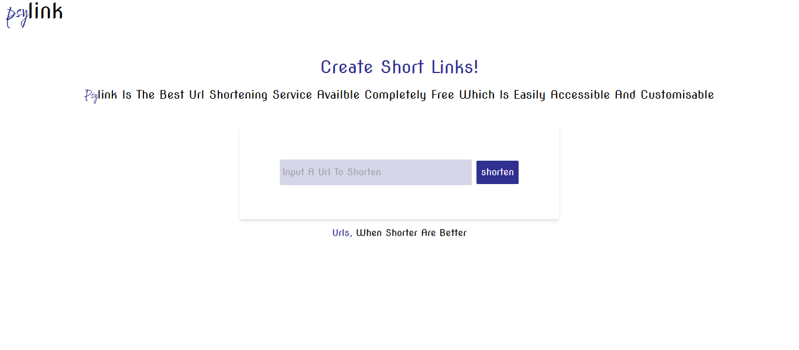

# About project

A url_shortening service using mongoose to connect to mongodb database from an express server. Frontend created with react. Both server and client done with typescript



## Run Locally

Clone the project

```bash
  git clone https://https://github.com/Nchekwube1/url_shortner.git
```

Install dependencies for client side

```bash
  npm install
```

or

```bash
yarn install
```

Start the react server

```bash
  npm run start
```

or

```bash
yarn start
```

Install dependencies for server

go to backend directory

```bash
cd backend
```

then run

```bash
npm install
```

or

```bash
yarn install
```

Start the express server

```bash
  npm run watch
```

or

```bash
yarn watch
```
